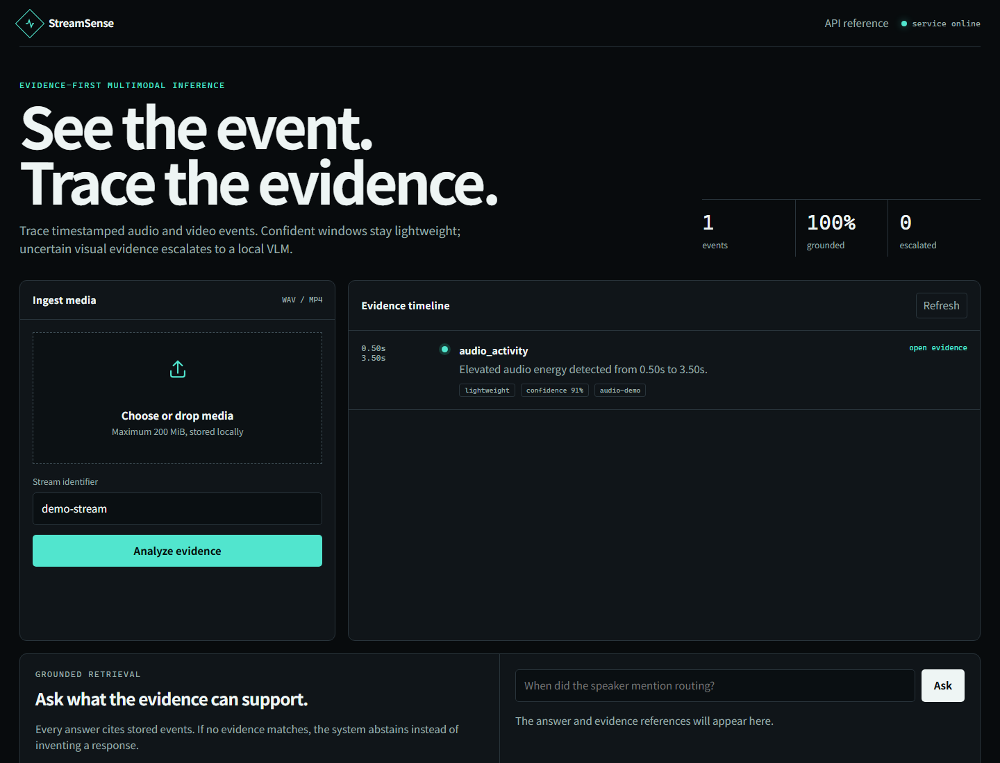

# StreamSense-Serve

Evidence-first audiovisual event inference with adaptive escalation to a vision-language model.



StreamSense-Serve turns time-aligned audio and video observations into structured events. Every
non-abstained result carries replayable evidence, and a configurable router escalates only risky,
uncertain, conflicting, or visually grounded requests to an expensive VLM worker.

## What is implemented

- Validated event/evidence schema and parameterized SQLite persistence.
- WAV activity detection, timestamped faster-whisper ASR, and video frame-change evidence.
- Risk/uncertainty/conflict-aware routing with deterministic exploration.
- OpenAI-compatible local VLM escalation for selected visual evidence.
- Evidence-constrained retrieval that abstains when no stored event supports an answer.
- FastAPI, Prometheus metrics, optional OpenTelemetry export, Docker, CLI, and web console.
- Reproducible RTX 4090 ASR latency and noise-robustness benchmarks under `benchmarks/results`.

## Quick start

```bash
python -m venv .venv
source .venv/bin/activate
python -m pip install -e ".[dev,media]"
pytest
streamsense serve --host 127.0.0.1 --port 8000
```

Open `http://127.0.0.1:8000/docs` for the API documentation.

To enable timestamped ASR, install `.[asr]` and set `STREAMSENSE_ASR_MODEL=small`. The model is
loaded lazily on the first media request. Video scene-change analysis uses the `media` extra.

To connect a local vLLM/SGLang server, set `STREAMSENSE_VLM_BASE_URL` and
`STREAMSENSE_VLM_MODEL`. Only observations selected by the adaptive router are sent to that
OpenAI-compatible endpoint; image evidence is embedded as a data URL and the response is schema
validated before persistence.

## Verified RTX 4090 result

On the committed 11-second public JFK sample, faster-whisper `small` with FP16 transcribed the
reference exactly. Excluding model download/load, the median of two warm runs was 0.356 seconds
(real-time factor 0.032). Seeded white-noise stress tests produced WER 0.0 at 20/10 dB, 0.091 at
0 dB, and 0.318 at -5 dB. These are single-sample engineering checks, not corpus-level quality
claims; raw JSON, configuration, transcript, and sample hash are committed.

## Safety and privacy

The project does not perform identity recognition. Use only media that you are licensed and
authorized to process. Outputs are decision support and must not be used as autonomous medical,
safety, or surveillance decisions.

## License

Apache-2.0. Third-party model and dataset licenses remain in force.
