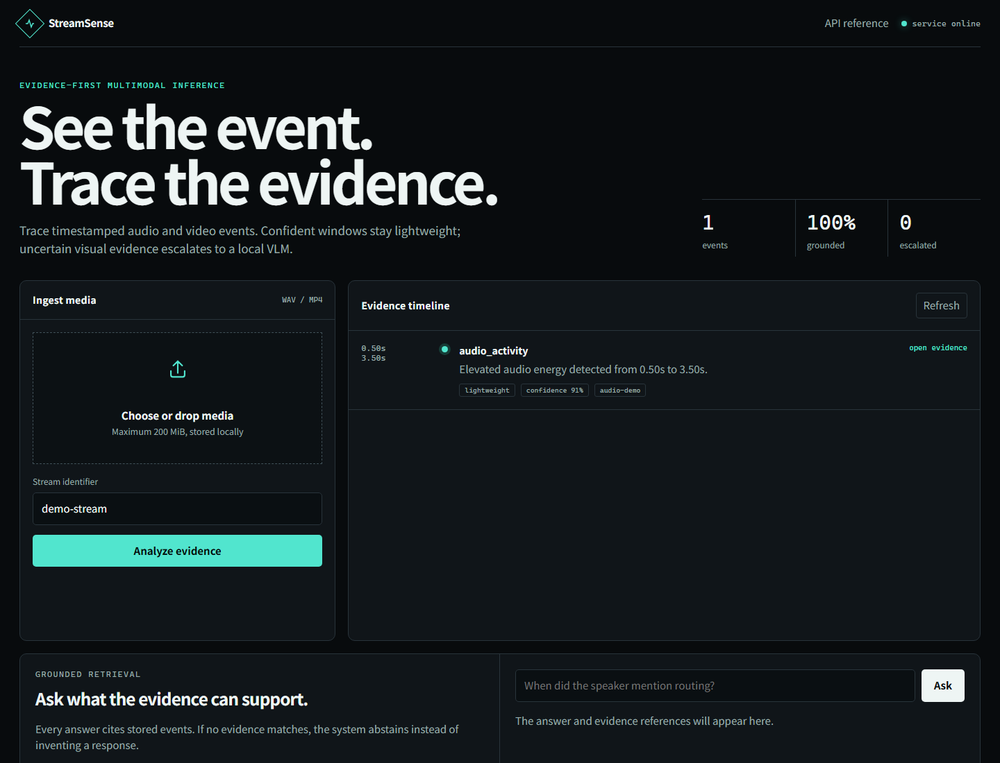

# StreamSense-Serve 2.0

[](https://github.com/Jatshi/StreamSense-Serve/actions/workflows/ci.yml)

[2.0 从零手搓学习手册](docs/streamsense_v2_from_scratch_zh.md) ·
[AutoDL 运行手册](docs/V2_AUTODL_RUNBOOK.md) ·
[项目计划](docs/PROJECT_PLAN.md)

Evidence-first multimodal inference, OpenAI-compatible serving, and a reviewable data flywheel.

[简体中文](README.zh-CN.md)



StreamSense-Serve turns time-aligned audio and video observations into structured events. Every
non-abstained result carries replayable evidence, and a configurable router escalates only risky,
uncertain, conflicting, or visually grounded requests to an expensive VLM worker.

## What is implemented

- Versioned vLLM, SGLang, and generic OpenAI-compatible backend profiles with explicit model,
  quantization, context-length, memory, timeout, and health contracts.
- EvidenceAgent-MM request/response adaptation with strict citation IDs and
  answer/clarify/abstain validation.
- Token-protected, deduplicated feedback persistence with explicit training consent/license,
  deterministic SFT/DPO candidates, a structured EvidenceAgent bridge, and hashed export manifest.
- Revision-guarded model manifest, atomic activation state, backend health gate, and rollback.
- Streaming load tests for TTFT, TPOT, request throughput, error rate, and optional raw
  `nvidia-smi` sampling. Streaming deltas are reported honestly as output units, not tokenizer
  tokens.
- Validated event/evidence schema and parameterized SQLite persistence.
- WAV activity detection, timestamped faster-whisper ASR, and video frame-change evidence.
- Risk/uncertainty/conflict-aware routing with deterministic exploration.
- OpenAI-compatible local VLM escalation for selected visual evidence.
- Explicit human-review fallback when optional heavyweight inference is absent or unavailable.
- Evidence-constrained retrieval that abstains when no stored event supports an answer.
- FastAPI, Prometheus metrics, optional OpenTelemetry export, Docker, CLI, and web console.
- Reproducible RTX 4090 ASR latency and noise-robustness benchmarks under `benchmarks/results`.

## Quick start

```bash
python -m venv .venv
source .venv/bin/activate
python -m pip install -e ".[dev,media]"
pytest
streamsense serve --host 127.0.0.1 --port 8000
```

## AutoDL-ready 2.0 entry points

No GPU is required for the smoke gate:

```bash
export PORTFOLIO_V2_MODE=smoke
bash scripts/autodl_v2_bootstrap.sh
bash scripts/autodl_v2_run.sh
```

For the RTX 4090 full run, create independent random admin/feedback tokens, inspect
`configs/backends.json`, then run:

```bash
export PORTFOLIO_V2_MODE=full
export STREAMSENSE_ADMIN_TOKEN="$(python -c 'import secrets; print(secrets.token_urlsafe(32))')"
export STREAMSENSE_FEEDBACK_TOKEN="$(python -c 'import secrets; print(secrets.token_urlsafe(32))')"
export STREAMSENSE_INFERENCE_TOKEN="$(python -c 'import secrets; print(secrets.token_urlsafe(32))')"
export STREAMSENSE_V2_ACTION=benchmark
bash scripts/autodl_v2_bootstrap.sh
bash scripts/autodl_v2_run.sh
```

The full runner starts the selected vLLM/SGLang profile, waits for its real health endpoint,
then starts the API. `STREAMSENSE_V2_ACTION=benchmark` writes measured API and streaming-backend
JSON and exits cleanly; `serve` keeps both processes resident. It does not synthesize performance
numbers. See
[`docs/V2_AUTODL_RUNBOOK.md`](docs/V2_AUTODL_RUNBOOK.md) for backend selection, feedback export,
load-test commands, hot switching, rollback, and failure recovery.

The existing `/v1/events`, `/v1/query`, and `/v1/media/analyze` contracts remain compatible.
The 2.0 additions are under `/v2/evidence-agent`, `/v2/feedback`, `/v2/models`, and
`/v2/inference`.

For the exact v0.1.0 reference environment, install `requirements.lock` followed by
`python -m pip install -e . --no-deps`. The regular extras remain the more flexible developer path.

Open `http://127.0.0.1:8000/docs` for the API documentation.

To enable timestamped ASR, install `.[asr]` and set `STREAMSENSE_ASR_MODEL=small`. The model is
loaded lazily on the first media request. Video scene-change analysis uses the `media` extra.

To connect a local vLLM/SGLang server, set `STREAMSENSE_VLM_BASE_URL` and
`STREAMSENSE_VLM_MODEL`. Only observations selected by the adaptive router are sent to that
OpenAI-compatible endpoint; image evidence is embedded as a data URL and the response is schema
validated before persistence.

Pinned model revisions and reference runtime settings are in `models.lock`. See the
[dataset card](docs/DATASET_CARD.md), [model card](docs/MODEL_CARD.md), and
[known failure cases](docs/FAILURE_CASES.md) before interpreting benchmark results.

## Verified RTX 4090 result

On the committed 11-second public JFK sample, faster-whisper `small` with FP16 transcribed the
reference exactly. Excluding model download/load, the median of two warm runs was 0.356 seconds
(real-time factor 0.032). Seeded white-noise stress tests produced WER 0.0 at 20/10 dB, 0.091 at
0 dB, and 0.318 at -5 dB. These are single-sample engineering checks, not corpus-level quality
claims; raw JSON, configuration, transcript, and sample hash are committed.

The same resident-model deployment completed the full upload-to-grounded-query flow in 3.034
seconds. A separate loopback health check completed 500/500 requests at concurrency 25 with
195.6 requests/s observed throughput and 334.8 ms p95 latency. These figures are reproducible
single-host diagnostics, not production capacity claims.

On the 20-case curated routing fixture, the rule router retained all 10 oracle-positive cases
while escalating 11/20 windows, compared with 20/20 for the always-escalate baseline. The fixture
GPU-cost reduction is 45%. Because thresholds were inspected against this hand-authored fixture,
this is a deterministic behavior/cost check rather than an unbiased deployment estimate.

The pinned local Qwen2.5-VL-3B-Instruct service completed the synthetic video-change pipeline in
4.168 seconds and persisted one grounded `vlm_visual_event`. After JSON-grammar warmup, three
streaming runs had 54.8 ms median TTFT and 313.6 ms median total latency; the first grammar request
took 2.803 seconds. Resident GPU memory was 17,855 MiB. The input generator, hashes, exact event,
configuration, and raw timings are committed; this remains a one-frame engineering check.

## Safety and privacy

The project does not perform identity recognition. Use only media that you are licensed and
authorized to process. Outputs are decision support and must not be used as autonomous medical,
safety, or surveillance decisions.

Inference queries and health, feedback writes, and all model-manifest operations require their
respective bearer tokens. The default examples bind to `127.0.0.1`; do not expose the FastAPI
process directly to the public internet. Feedback may contain transcripts or corrections, so
review and redact exported JSONL before publishing or training. Training export is opt-in:
`consent_for_training=true` and a declared `source_license` are both required.

## License

The project code is Apache-2.0. Third-party model and dataset terms remain in force; in
particular, the pinned Qwen2.5-VL-3B-Instruct weights use the Qwen Research License and are
restricted to non-commercial use unless separately licensed. See [third-party notices](THIRD_PARTY_NOTICES.md).
